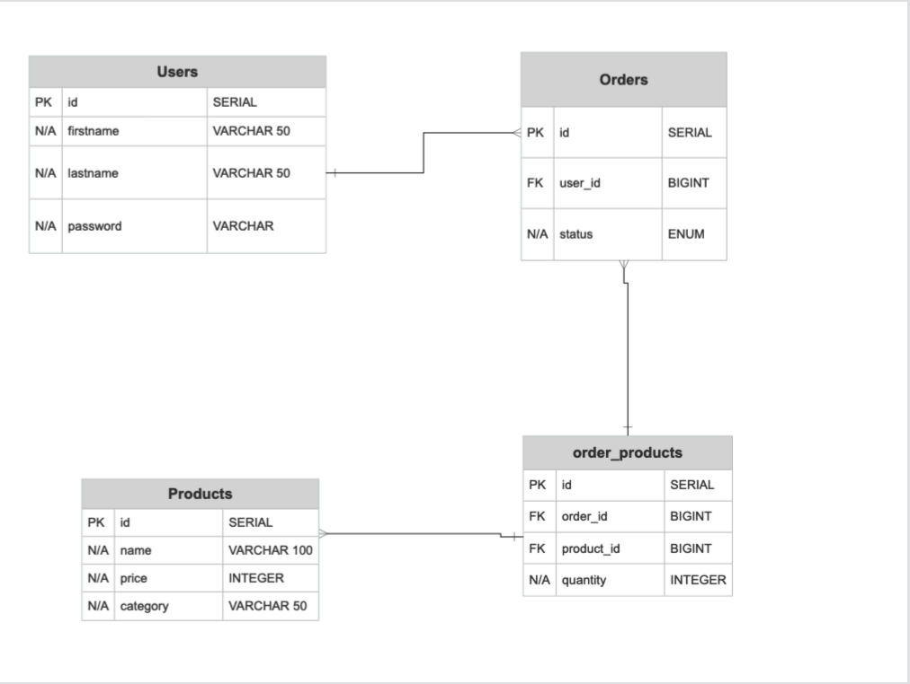

# API Requirements
The company stakeholders want to create an online storefront to showcase their great product ideas. Users need to be able to browse an index of all products, see the specifics of a single product, and add products to an order that they can view in a cart page. You have been tasked with building the API that will support this application, and your coworker is building the frontend.

These are the notes from a meeting with the frontend developer that describe what endpoints the API needs to supply, as well as data shapes the frontend and backend have agreed meet the requirements of the application. 

## API Endpoints
#### Products
- Index 
- Show
- Create [token required]
- [OPTIONAL] Top 5 most popular products 
- [OPTIONAL] Products by category (args: product category)

#### Users
- Index [token required]
- Show [token required]
- Create N[token required]

#### Orders
- Current Order by user (args: user id)[token required]
- [OPTIONAL] Completed Orders by user (args: user id)[token required]

## Data Shapes
#### Product
-  id
- name
- price
- [OPTIONAL] category

#### User
- id
- firstName
- lastName
- password

#### Orders
- id
- id of each product in the order
- quantity of each product in the order
- user_id
- status of order (active or complete)

# Api Documenation

User Routes: 

| Method | Route | URL | Description | Return |
| --- | --- | --- | --- | --- |
| GET | Users Index | /users | Getting All the available users in the data base | All Users |
| GET | Users Show | /users/:id | Getting a specific user with the required id | A user |
| GET | User’s Orders | /users/:id/orders | Getting all the orders made by a specific user with the required id | Orders |
| POST | Users Create | /users | Creating a User with the required information passed through the request body | A User |

Order Routes: 

| Method | Route | URL | Description | Return |
| --- | --- | --- | --- | --- |
| GET | Orders Index | /orders | Getting All the available orders in the data base | All Orders |
| GET | Orders Show | /order/:id | Getting a specific order with the required id | An Order |
| GET | Order Products | /orders/:id/products | Getting products of a specific order using the required id | List of products |
| POST | Users Create | /orders | Create a new Order | An Order |
| POST | Add Product  |/orders/:id/products| Adds a new Product to an order | A Cart|

Product Routes: 

| Method | Route | URL | Description | Return |
| --- | --- | --- | --- | --- |
| GET | Products Index | /products | Getting All the available products in the data base | All Products |
| GET | Produc Show | /product/:id | Getting a specific product with the required id | A Product |
| POST | Product Create | /products | Create a new Product | A Product |

**DataBase Schema** : 

ERD : 

Database Schemas :

#### Users

| Field    | Type             | Special Attributes |
| -------- | ---------------- | ------------------ |
| **id**   | **Serial**       | **Primary Key**    |
| **firstname** | **VarChar(50)** | **N/A**        |
| **lastname** | **VarChar(50)** | **N/A**        |
| **password** | **VarChar** | **N/A**        |

#### Orders

| Field    | Type             | Special Attributes |
| -------- | ---------------- | ------------------ |
| **id**   | **Serial**       | **Primary Key**    |
| **status** | **ENUM**       | **N/A**            |
| **user_id** | **BIGINT**       | **Foreign Key** |

#### Products

| Field     | Type             | Special Attributes |
| --------- | ---------------- | ------------------ |
| **id**    | **Serial**       | **Primary Key**    |
| **name**  | **VARCHAR (100)** | **N/A**            |
| **price** | **Integer** | **N/A**            |
| **category** | **VARCHAR (50)**      | **N/A**  |

#### Order_Products

| Field          | Type        | Special Attributes |
| -------------- | ----------- | ------------------ |
| **id**         | **Serial**  | **Primary Key**    |
| **order_id** | **BIGINT** | **Foreign Key**      |
| **product_id** | **BIGINT** | **Foreign Key**    |
| **quantity** | **BIGINT** |          **N/A**    |

